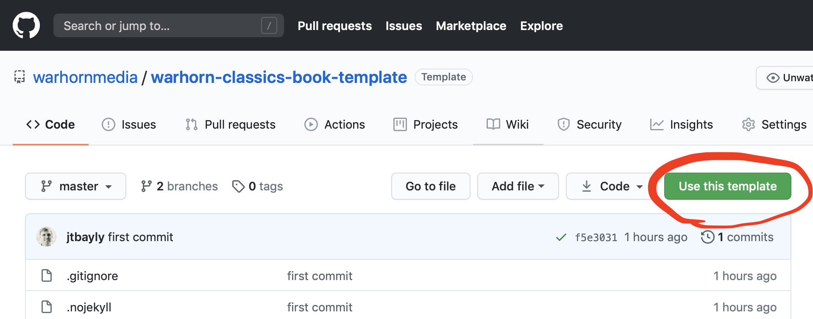

# Some quick reminders

## Creating a new book

1. Go to [the repo](https://github.com/warhornmedia/warhorn-classics-book-template) on Github and click "Use this template." 

```{r echo = FALSE, fig.align = 'center', out.width = "65%"}

```

2. Change the owner to warhornmedia. Enter a repository name using the format "authorlastname-short-book-title". Set the repository to public. And include all branches. Then click "Create repository from template"

```{r echo = FALSE, fig.align = 'center', out.width = "65%"}
knitr::include_graphics('images/screenshot2.png')
```

3. Clone the new repo to your computer and navigate into its folder in Terminal. Then run the following command locally:

```
travis encrypt GITHUB_PAT=yourTokenGoesHere --add
```

4. Add the project on travis-ci.com (You may have to log out and back in for the project to show up.)

*Congrats!* You now have a new book that will rebuild automatically any time you push changes to github.

For more in-depth instructions on setting up your new book, as well as important information on how to code the book, check out the [style guide](https://warhornmedia.github.io/style-guide).
